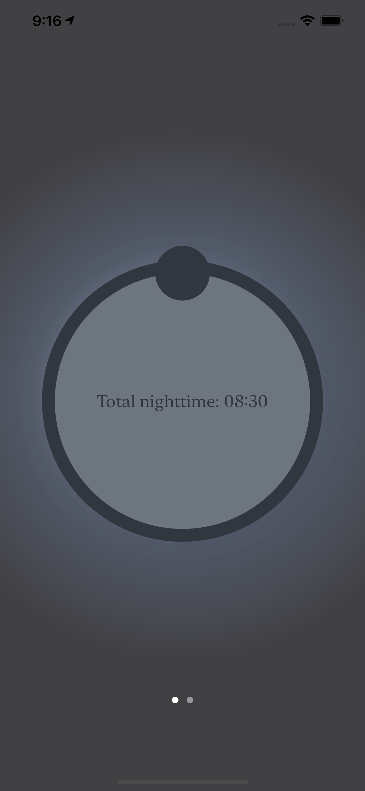

# Daylight
iOS App providing a visual representation of the time until sunrise / sunset.

 

# Overview
- MVVM architecture
- Uses Location Services
- Uses NTSolar API for data processing (https://gist.github.com/neilt/6bc284ac7ce00d566002bc45bc0d86dd)
- Widgets created for all 3 standard sizes

# Features
Onboarding tutorial

     

Main App
- Visual representation of daylight, 
- Sunrise/sunset times and location
- Time until sunrise/sunset
- Total daylight/night

   

Night Mode

   

# On-going Development
- Change the background color gradually around sunrise/sunset.
